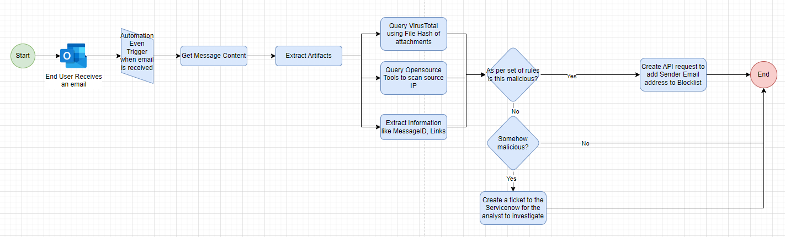

#Mock Security Automation Playbook

## Mock Phishing Email Security Automation
This workflow demonstrates how emails are automatically checked. Whenever a user receives an email, the workflow kicks in. It goes through the email, extracting key details like attachments, URLs, and message IDs. With this info, it taps into public threat intelligence tools such as VirusTotal, Crowsec, and MetaDefender using APIs. These tools help assess if the email poses any threats based on indicators of compromise and predefined rules. If deemed malicious, the workflow can take action, like blocking the sender's email address.

