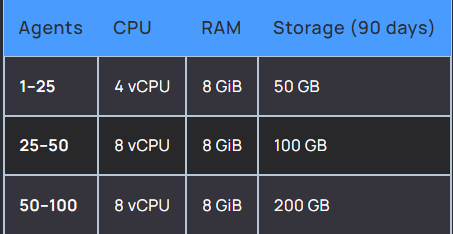

# Security Ingestion

## Summary

Using one of the famous open-source SIEM/XDR solutions called Wazuh, we can now take care of SIEM and XDR at the same time. Wazuh is perfect for organizations that are starting to shift left on their security without spending a large amount to implement SIEM and XDR.

This mark down file contains guide on setting up the Wazuh Server.
The installation of the Wazuh Agent which will be installed to the user endpoint is here: [Wazuh Agent Setup Guide](Installing-Wazuh-Agent.docx)

# Simple SIEM Architecture


### Requirements
- Hardware
  


- System


### The Goal
The goal is to setup Wazuh and install agents on each of the endpoints.

### Wazuh Installation:
1. Create an ubuntu server based on the Requirements above.
2. SSH to your server and run this command.
``` curl -sO https://packages.wazuh.com/4.7/wazuh-install.sh && sudo bash ./wazuh-install.sh -a ```
3. After installing Wazuh the details below will appear to your Terminal. Take note of the username and password.

```
INFO: --- Summary ---
INFO: You can access the web interface https://<wazuh-dashboard-ip>
    User: admin
    Password: <ADMIN_PASSWORD>
INFO: Installation finished.
```
4. Make sure to open the necessary ports that wazuh is using. https://documentation.wazuh.com/current/user-manual/agent/agent-enrollment/index.html
5. Open your web browser and access you wazuh server via hostname, domain or IP Address. <!-- Note the in production you'll need to map out a domain for your wazuh server -->
6. Login to your Wazuh Server and create a new agent. Follow the steps here in enrolling an agent https://documentation.wazuh.com/current/user-manual/agent/agent-enrollment/index.html
   <!-- There are options available for different types of device. Select the appropriate option for the machine where you want to deploy the Wazuh Agent -->
   <!-- In this example we will be using Windows Device -->
7. Follow the instructions indicated in enrolling an Agent and copy the powershell command that is generated to instal the wazuh agent. See this document for detailed installation instruction [Click here](Installing-Wazuh-Agent.docx)
8. Go to your Windows Device and open a Powershell terminal as an Administrator. Note: It's requires Administrator previliges for it to work.
9. Paste the copied code from Wazuh Dashboard Agent enrollment. ( **Note**: If you want to deploy this on a large scale you can use the Windows Group Policy in deploying it)
10. Now that you have installed the Wazuh Agent, you now need to active the Wazuh Service ``` NET START WazuhSvc ```
11. Wait for 1 - 3 minutes and refresh your Wazuh Dashboard. The Agent should now be reporting to the Wazuh Server. 
<!-- If the agent is not reporting consider opening the ports needed to be opened for the wazuh to receive the reports -->


12. Now you can use the Wazuh SIEM/XDR for Security Events and Compliance Monitoring

 


 Follow this documentation for the guide in installing Wazuh Agent to the desired endpoints: [Wazuh Agent Setup Guide](Installing-Wazuh-Agent.docx)
